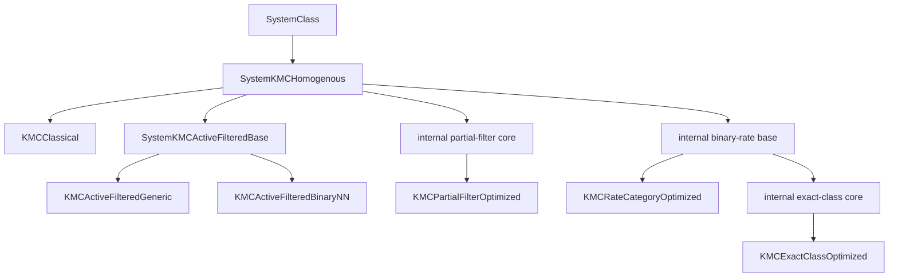

# NanoKMC

NanoKMC is a single-core C++17 research implementation of an **Active-Filtered lattice kinetic Monte Carlo (KMC)** formulation together with controlled reference solver architectures for the binary FCC Kawasaki-exchange benchmark studied in the accompanying paper.

The public `0.1.0` release is intentionally focused: it provides a reproducible implementation of the paper method, reference solvers, validation tests, examples, and scientific provenance. It is **not** presented as a general-purpose KMC framework for arbitrary lattices or reaction mechanisms.

## Scientific scope

NanoKMC's Active-Filtered method maintains the complete population of currently unlike nearest-neighbour bonds, samples uniformly from that structural population, evaluates the exact Metropolis acceptance probability only for the selected pair, and retains residual physical rejection. For the FCC benchmark, the common simulation coordinate advances by

\[
\Delta \mathrm{MCS}=\frac{6}{B},
\]

where `B` is the current number of undirected unlike nearest-neighbour bonds.

Two public Active-Filtered backends share exactly the same structural candidate population, selection rule, and clock:

- `KMCActiveFilteredGeneric` reconstructs an ordered local environment after selection and evaluates the bundled symmetric nearest-neighbour Hamiltonian through a general local-energy route.
- `KMCActiveFilteredBinaryNN` uses a binary nearest-neighbour sufficient descriptor and precomputed Metropolis factors for the same benchmark physics.

Energetic information is **not** used to bias Active-Filtered event selection.

## Public solvers

| `SystemID` | Scientific role |
|---|---|
| `KMCClassical` | Blind random site-neighbour proposal with structural nulls and Metropolis acceptance. |
| `KMCActiveFilteredGeneric` | Active-Filtered method with explicit selected-pair local-environment evaluation. |
| `KMCActiveFilteredBinaryNN` | Optimized binary-NN backend of the same Active-Filtered method. |
| `KMCPartialFilterOptimized` | Controlled partial structural-filter reference architecture. |
| `KMCRateCategoryOptimized` | Controlled coarse rate-category rejection reference (`RateCategoryCount=1|2|4|8`, default `4`). |
| `KMCExactClassOptimized` | Controlled exact finite-rate-class rejection-free reference architecture. |

The three controlled reference architectures are implemented in the same code base to isolate architectural trade-offs. They are **not** claimed as NanoKMC inventions or as independent reproductions of particular external software packages. See [`docs/literature.md`](docs/literature.md).

## Architecture



Implementation files are compiled as normal separate C++ translation units. Internal `Core` classes share validated mechanics but are not public `SystemID` choices.

## Quick start

For the shortest build → validate → run path, see [`docs/quickstart.md`](docs/quickstart.md).

### Requirements

- CMake 3.16+
- C++17 compiler
- `zip` and `unzip` available on the command line for checkpoint-state archives
- Python 3 for validation and benchmark helper scripts

### Standard build

```bash
cmake -S . -B build -DCMAKE_BUILD_TYPE=Release
cmake --build build
ctest --test-dir build --output-on-failure
```

### Paper-reproduction build

The benchmark paper used an explicitly frozen compiler policy. Enable it deliberately when reproducing paper-style timings:

```bash
cmake -S . -B build-paper -DCMAKE_BUILD_TYPE=Release -DNANOKMC_PAPER_BUILD=ON
cmake --build build-paper
ctest --test-dir build-paper --output-on-failure
```

For GCC/Clang, `NANOKMC_PAPER_BUILD=ON` applies `-O1` and `NDEBUG` explicitly so that a toolchain's default `Release` optimization cannot silently change the benchmark build.

Windows/MSYS2 UCRT64 users can run:

```text
scripts\windows\build_and_test.bat
```

## Command line

```bash
./build/nanokmc --version
./build/nanokmc --list-solvers
./build/nanokmc --help
./build/nanokmc examples/active_filtered_binary_nn
```

A run directory must contain `nanokmc.in` and `output/CalcData.csv`. Invalid or incomplete run directories fail early with a clear diagnostic. See [`docs/input-output.md`](docs/input-output.md).

## Validation

The repository ships release-level regression tests for solver invariants, output formats, configurable profile axes, and rate-category limiting cases:

```bash
ctest --test-dir build --output-on-failure
```

or directly:

```bash
python validation/run_smoke.py --exe build/nanokmc
```

The solver smoke test checks, among other things:

- species conservation;
- independent structural unlike-bond recounting;
- residual rejection in the default four-category rate solver;
- rejection-free execution of the exact-class reference solver;
- same-seed non-timing equivalence of the Generic and BinaryNN Active-Filtered backends under the bundled benchmark Hamiltonian.

The release is tested with GCC and Clang in CI; the validation scope and sanitizer checks are summarized in [`docs/validation.md`](docs/validation.md).

## Outputs

NanoKMC includes release-tested outputs in two groups:

- **Simulation / morphology observables:** benchmark diagnostics, cluster distributions, axial/cylindrical/spherical composition profiles, and an XZ composition projection.
- **State / visualization exports:** packed lattice checkpoints, per-species and combined RasMol/XYZ output, Blender-oriented XYZ output, and coordinate CSV.

Definitions, schemas, and limitations are documented in [`docs/output-features.md`](docs/output-features.md).


## Reproducibility and benchmark boundaries

Read [`docs/reproducibility.md`](docs/reproducibility.md) before using NanoKMC for paper reproduction or performance comparison. In particular:

- solver instances are single-threaded;
- the repository's internal benchmark helpers compare the six in-code solver paths only;
- the complete cross-software paper benchmark is maintained separately from this focused software release;
- performance rankings should not be inferred from parallel batch wall time;
- scientific correspondence is a stronger requirement than same-seed identity when a change intentionally alters data-structure/RNG ordering.

## Documentation

- [Quick start](docs/quickstart.md)
- [Reproducibility](docs/reproducibility.md)
- [Architecture](docs/architecture.md)
- [Solver reference](docs/solvers.md)
- [Benchmark physical model](docs/physics-model.md)
- [Input/output reference](docs/input-output.md)
- [Output features](docs/output-features.md)
- [Scientific provenance and literature](docs/literature.md)
- [Validation](docs/validation.md)
- [Extending the Generic backend](docs/extending.md)
- [Windows/MSYS2](docs/windows-msys2.md)
- [Contributing](CONTRIBUTING.md)

## License

BSD-3-Clause. See [`LICENSE`](LICENSE).

## Citation

Machine-readable citation metadata are provided in [`CITATION.cff`](CITATION.cff). When the accompanying paper receives its final bibliographic record, cite the paper for the Active-Filtered formulation and the tagged software release when the implementation itself is material to your work.
