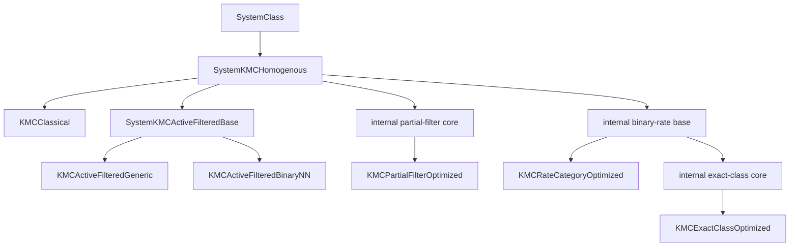
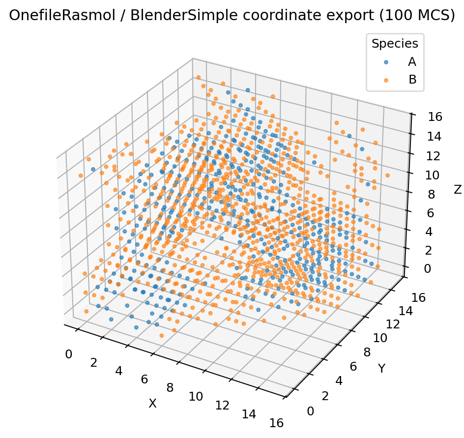

# NanoKMC

NanoKMC is a single-core C++17 research code for **lattice kinetic Monte Carlo (KMC) of conserved nearest-neighbour exchange on periodic FCC lattices**. It provides six solver paths spanning blind proposals, structural active-event filtering, partial filtering, coarse rate categories, and exact finite-rate classes.

The `0.1.0` release contains the validated homogeneous nearest-neighbour model and comparison configuration used in the accompanying NanoKMC study, but the code is intended to remain useful beyond that benchmark. In particular, the Active-Filtered Generic backend separates structural event management from local energetic evaluation so that richer local Hamiltonians can be implemented without rewriting the active-event engine.

NanoKMC is **not yet a general-purpose KMC framework for arbitrary lattices or arbitrary reaction networks**. The current reusable scope is an FCC exchange-KMC code base with explicit extension points for local physics, initialization, and optimized acceptance backends.

## Scientific and software scope

NanoKMC's Active-Filtered method maintains the complete population of currently unlike nearest-neighbour bonds, samples uniformly from that structural population, evaluates the Metropolis acceptance probability only for the selected pair, and retains residual physical rejection. For the FCC topology, the common simulation coordinate advances by

\[
\Delta \mathrm{MCS}=\frac{6}{B},
\]

where `B` is the current number of undirected unlike nearest-neighbour bonds.

Two public Active-Filtered backends share exactly the same structural candidate population, selection rule, and clock:

- `KMCActiveFilteredGeneric` reconstructs an ordered local environment after selection and evaluates the bundled symmetric nearest-neighbour Hamiltonian through a general local-energy route. Its structural engine and local-environment interface are suitable for multi-species extensions.
- `KMCActiveFilteredBinaryNN` uses a binary nearest-neighbour sufficient descriptor and precomputed Metropolis factors for the bundled binary model.

Energetic information is **not** used to bias Active-Filtered event selection.

### Species scope

The packed FCC lattice core supports `2..16` species. The Generic Active-Filtered structural engine treats any pair with different species labels as structurally active and carries the full local species labels into its acceptance interface. The bundled homogeneous initializer, however, currently populates only species `0` and `1`, and the supplied examples/validation campaign are binary. A true `>2`-species model therefore requires extending the initializer (or otherwise supplying a compatible state) and, where appropriate, the local acceptance model. The Classical, BinaryNN, Partial-Filter, Rate-Category, and Exact-Class implementations in this release are explicitly binary.

## Public solvers

| `SystemID` | Scientific role |
|---|---|
| `KMCClassical` | Blind random site-neighbour proposal with structural nulls and Metropolis acceptance. |
| `KMCActiveFilteredGeneric` | Active-Filtered method with explicit selected-pair local-environment evaluation and an extensible acceptance interface. |
| `KMCActiveFilteredBinaryNN` | Optimized binary-NN backend of the same Active-Filtered method. |
| `KMCPartialFilterOptimized` | Partial structural-filter reference architecture. |
| `KMCRateCategoryOptimized` | Coarse rate-category rejection reference (`RateCategoryCount=1|2|4|8`, default `4`). |
| `KMCExactClassOptimized` | Exact finite-rate-class rejection-free reference architecture. |

The reference architectures are implemented in the same code base to isolate algorithmic trade-offs. They are **not** claimed as NanoKMC inventions or as independent reproductions of particular external software packages. See [`docs/literature.md`](docs/literature.md).

## Architecture



Implementation files are compiled as normal separate C++ translation units. Internal `Core` classes share validated mechanics but are not public `SystemID` choices.

## Quick start

For the shortest build → validate → run path, see [`docs/quickstart.md`](docs/quickstart.md).

### Requirements

- CMake 3.16+
- C++17 compiler
- `zip` and `unzip` available on the command line for checkpoint-state archives
- Python 3 for validation and benchmark helper scripts

### Standard build

```bash
cmake -S . -B build -DCMAKE_BUILD_TYPE=Release
cmake --build build
ctest --test-dir build --output-on-failure
```

### Manuscript benchmark build

A frozen compiler policy is retained so the performance configuration used for the accompanying manuscript can be reproduced deliberately:

```bash
cmake -S . -B build-paper -DCMAKE_BUILD_TYPE=Release -DNANOKMC_PAPER_BUILD=ON
cmake --build build-paper
ctest --test-dir build-paper --output-on-failure
```

For GCC/Clang, `NANOKMC_PAPER_BUILD=ON` applies `-O1` and `NDEBUG` explicitly so that a toolchain's default `Release` optimization cannot silently change that benchmark configuration.

Windows/MSYS2 UCRT64 users can run:

```text
scripts\windows\build_and_test.bat
```

## Command line

```bash
./build/nanokmc --version
./build/nanokmc --list-solvers
./build/nanokmc --help
./build/nanokmc examples/active_filtered_binary_nn
```

A run directory must contain `nanokmc.in` and `output/CalcData.csv`. Invalid or incomplete run directories fail early with a diagnostic. See [`docs/input-output.md`](docs/input-output.md).

## Validation

The repository ships release-level regression tests for solver invariants, input parsing/validation, output formats, configurable profile axes, and rate-category limiting cases:

```bash
ctest --test-dir build --output-on-failure
```

The validation suite checks, among other things:

- all six public solver paths;
- species conservation;
- independent structural unlike-bond recounting;
- residual rejection in the default four-category rate solver;
- rejection-free execution of the exact-class reference solver;
- same-seed non-timing equivalence of the Generic and BinaryNN Active-Filtered backends under the bundled binary Hamiltonian;
- full `uint64_t` seed parsing;
- safe rejection of invalid packed-lattice dimensions;
- exact parameter-name matching, blank-line-safe checkpoint parsing, and checkpoint-order validation.

The release is tested with GCC and Clang in CI, plus AddressSanitizer/UndefinedBehaviorSanitizer and Windows/MSYS2 UCRT64. See [`docs/validation.md`](docs/validation.md).

## Outputs

NanoKMC includes release-tested outputs in two groups:

- **Simulation / morphology observables:** benchmark diagnostics, cluster distributions, axial/cylindrical/spherical composition profiles, and an XZ composition projection.
- **State / visualization exports:** packed lattice checkpoints, per-species and combined RasMol/XYZ output, Blender-oriented XYZ output, and coordinate CSV.

Definitions, schemas, and limitations are documented in [`docs/output-features.md`](docs/output-features.md).



## Reproducibility and checkpoint boundary

Read [`docs/reproducibility.md`](docs/reproducibility.md) before performance comparison or exact release reproduction. In particular:

- solver instances are single-threaded;
- packed checkpoints store the lattice state, **not** the `mt19937_64` engine state;
- restarting a checkpoint in a new process therefore reproduces the saved physical state but is not expected to reproduce the exact uninterrupted random trajectory;
- performance rankings should not be inferred from parallel batch wall time;
- scientific correspondence is a stronger requirement than same-seed identity when a change intentionally alters internal data-structure/RNG ordering.

## Documentation

- [Quick start](docs/quickstart.md)
- [Reproducibility](docs/reproducibility.md)
- [Architecture](docs/architecture.md)
- [Solver reference](docs/solvers.md)
- [Bundled physical model](docs/physics-model.md)
- [Input/output reference](docs/input-output.md)
- [Output features](docs/output-features.md)
- [Scientific provenance and literature](docs/literature.md)
- [Validation](docs/validation.md)
- [Extending NanoKMC](docs/extending.md)
- [Known limitations](docs/known-limitations.md)
- [Windows/MSYS2](docs/windows-msys2.md)
- [Contributing](CONTRIBUTING.md)

## License

BSD-3-Clause. See [`LICENSE`](LICENSE).

## Citation and archival

Machine-readable citation metadata are provided in [`CITATION.cff`](CITATION.cff). Tagged research releases are intended to be archived with Zenodo so that the exact software version used in a publication can be cited with a version-specific DOI. After the first Zenodo archive is created, the DOI can be added to the default branch's README and citation metadata without changing the immutable release tag.

When the accompanying scientific paper receives its final bibliographic record, cite the paper for the method/scientific results and cite the tagged software release when the implementation itself is material to your work.
