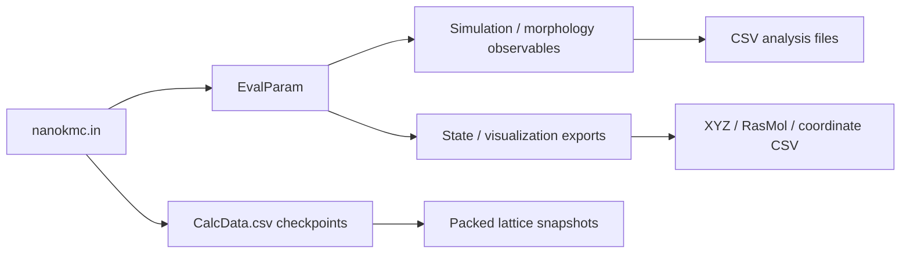
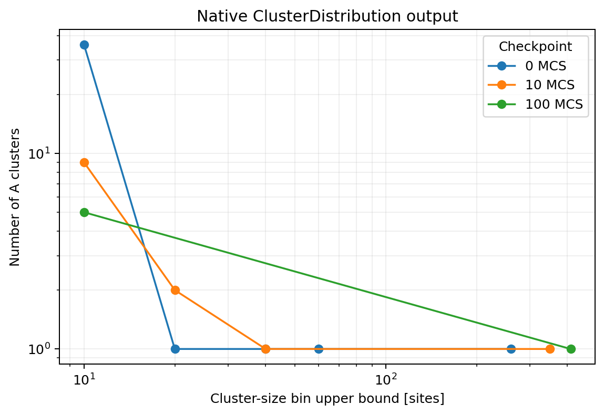
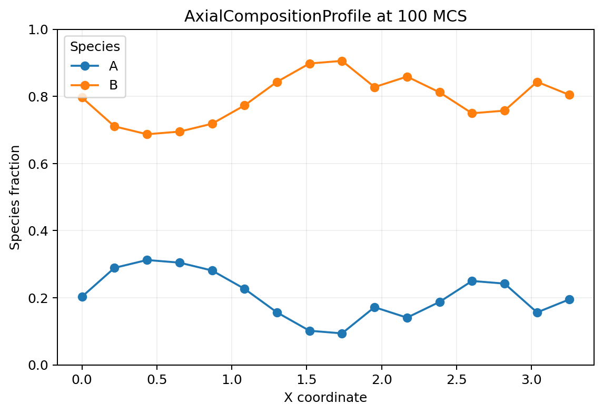
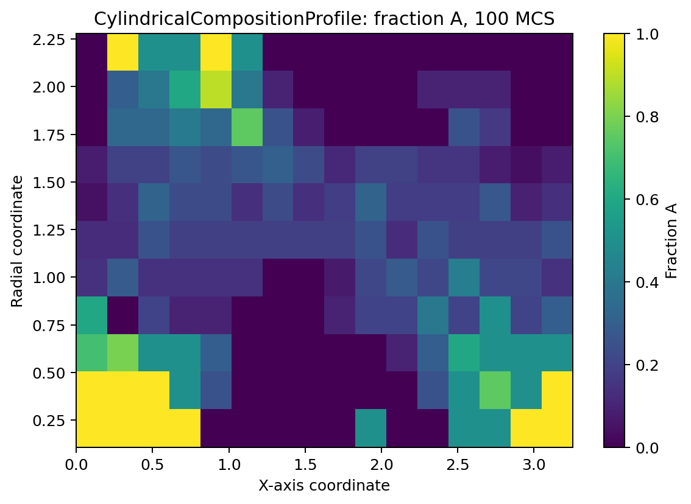
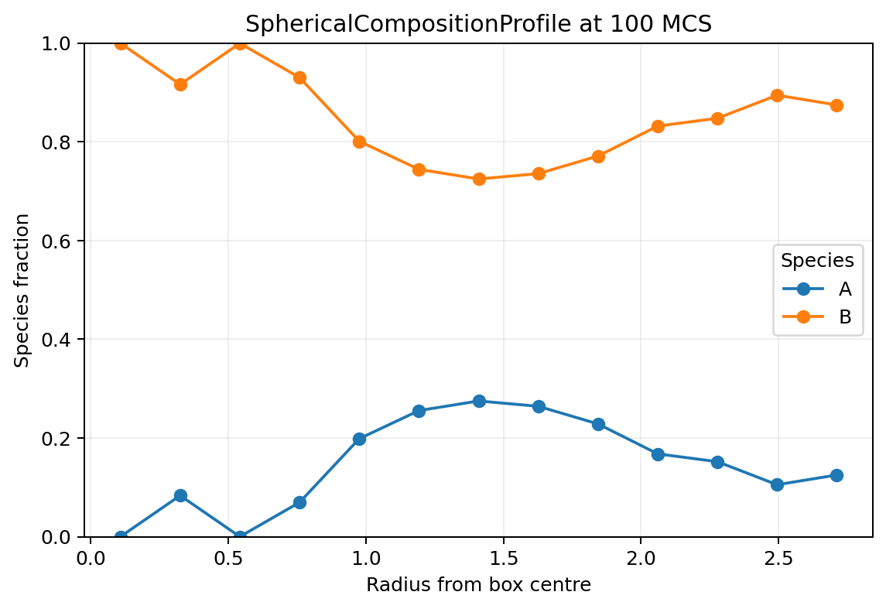
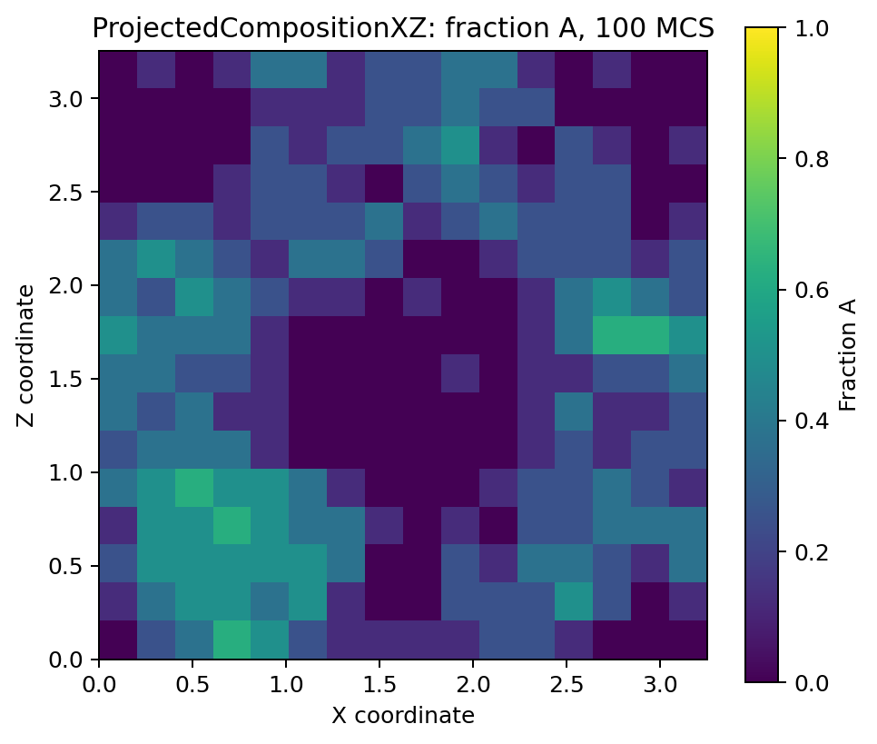

# Output features

NanoKMC evaluates requested output at every checkpoint listed in `output/CalcData.csv`. The public `0.1.0` interface deliberately separates numerical state analysis from state/export representations.



All output tokens listed on this page are exercised by `validation/run_output_smoke.py`. The configurable profile directions are additionally exercised by `validation/run_profile_axis_smoke.py`.

## Enabling outputs

Outputs are selected in the run input file. Tokens must appear in `EvalParam`:

```text
EvalParam=" Benchmark ClusterDistribution AxialCompositionProfile Rasmol ";
AxialCompositionProfileAxis="Z";
```

`EvalParam` answers **what** should be generated. Additional feature-specific fields, such as `AxialCompositionProfileAxis`, answer **how** that analysis is configured.

## Simulation / morphology observables

| `EvalParam` token | Output | Purpose |
|---|---|---|
| `Benchmark` | `evaluation/Benchmark.csv` | solver-independent bond recount, event counters, common-MCS coordinate, clean cumulative evolution timer and species populations |
| `ClusterDistribution` | `evaluation/clusters_S*.csv`, `surfaceatoms_S*.csv`, `clusterbonds_S*.csv` | nearest-neighbour connected-component histogram and associated surface/bond summaries for each species |
| `AxialCompositionProfile` | `evaluation/AxialCompositionProfile/axis_<X|Y|Z>.csv` | species composition versus position along a configurable Cartesian axis |
| `CylindricalCompositionProfile` | `evaluation/CylindricalCompositionProfile/axis_<X|Y|Z>.csv` | species composition versus axial position and radial distance from a box-centred cylinder axis |
| `SphericalCompositionProfile` | `evaluation/SphericalCompositionProfile/profile.csv` | species composition in concentric shells around the geometric box centre |
| `ProjectedCompositionXZ` | `evaluation/ProjectedCompositionXZ/projection.csv` | species composition projected onto the XZ plane by integrating over Y |

### `Benchmark`

**Purpose.** Provides the compact solver-independent benchmark and consistency stream used by the validation tooling.

**Enable.**

```text
EvalParam=" Benchmark ";
```

**Important fields.** `BondNumberInternal`, `UnequalBondCount`, `InterfaceDensityFCC`, event counters, `CommonMCSExact`, `EvolutionWallSecondsCumulative`, total sites, and species populations. The clean evolution timer excludes checkpoint evaluation/output work outside the KMC evolution loop.

**Limitations.** It is a benchmark/performance record, not a complete morphology description. For publication timing, keep output policy controlled because the simulation and evaluation layers have intentionally separate timing semantics.

### `ClusterDistribution`

**Purpose.** Computes nearest-neighbour connected components independently for each species and writes the native cluster-size histogram plus associated surface and cluster-bond summaries.

**Enable.**

```text
EvalParam=" ClusterDistribution ";
```

**Output.** `clusters_S0.csv`, `clusters_S1.csv`, ... use the native histogram layout. Bins 0–998 represent cluster-size upper bounds 10, 20, ..., 9990 sites; bin 999 collects clusters larger than 9990 sites. The routine is non-destructive: temporary traversal marks are restored before KMC evolution continues.



**Limitations.** The native binning is intentionally preserved for backward compatibility. The paper benchmark may derive alternative cluster thresholds/binning from common snapshots.

### `AxialCompositionProfile`

**Purpose.** Reports the species fraction along one Cartesian direction. This is useful for composition gradients, segregation, slab/interface evolution and diffusion-front analysis.

**Enable and configure.**

```text
EvalParam=" AxialCompositionProfile ";
AxialCompositionProfileAxis="X";
```

Accepted axes are `X`, `Y`, and `Z`; invalid or missing values fall back to `X`.

**Definition.** Each occupied FCC half-grid plane perpendicular to the chosen axis forms one bin. Coordinates are reported as `0.5 * lc * coordinate_index`.



**Output columns.** `checkpoint_mcs`, `axis`, `coordinate_index`, `coordinate`, `species`, `species_name`, `count`, `site_count`, `fraction`.

**Limitations.** This is a coordinate-resolved box profile. It does not recenter a translating morphology or remove the periodic-box seam.

### `CylindricalCompositionProfile`

**Purpose.** Reports species composition as a two-dimensional function of axial position and radial distance from a cylinder axis through the geometric box centre.

**Enable and configure.**

```text
EvalParam=" CylindricalCompositionProfile ";
CylindricalCompositionProfileAxis="Z";
```

Accepted axes are `X`, `Y`, and `Z`.

**Definition.** The selected axis supplies the axial coordinate. Radius is the Euclidean distance in the perpendicular stored half-grid plane from its geometric centre. Radial bins have one half-grid-index width and are reported at bin centres in `lc/2` units.



**Output columns.** `checkpoint_mcs`, `axis`, `axial_index`, `axial_coordinate`, `radial_bin`, `radial_coordinate`, `species`, `species_name`, `count`, `site_count`, `fraction`.

**Limitations.** This is a spatial composition map, **not** a pair-correlation radial-distribution function `g(r)`. The radial origin is the geometric box centre and distances are not minimum-image recentered across periodic boundaries.

### `SphericalCompositionProfile`

**Purpose.** Reports species fraction in concentric shells about the geometric centre of the simulation box; useful for droplet/core-shell and radially segregated states.

**Enable.**

```text
EvalParam=" SphericalCompositionProfile ";
```

**Definition.** Shell index is the floored Euclidean distance in stored FCC half-grid coordinates from the geometric box centre. Reported shell coordinates use the shell centre in `lc/2` units.



**Output columns.** `checkpoint_mcs`, `radial_bin`, `radial_coordinate`, `species`, `species_name`, `count`, `site_count`, `fraction`.

**Limitations.** This is a box-centred composition profile, not `g(r)`, and it does not automatically follow a translating precipitate or apply a minimum-image recentering operation.

### `ProjectedCompositionXZ`

**Purpose.** Produces a two-dimensional species-composition map in XZ by integrating occupancy over the Y direction.

**Enable.**

```text
EvalParam=" ProjectedCompositionXZ ";
```

**Definition.** Every valid lattice site with the same `(x,z)` index contributes to one projection bin. Fractions are calculated over all contributing Y sites.



**Output columns.** `checkpoint_mcs`, `x_index`, `x_coordinate`, `z_index`, `z_coordinate`, `species`, `species_name`, `count`, `site_count`, `fraction`.

**Limitations.** The projection intentionally discards Y-resolved information. It is a composition projection, not a direct rendering of individual lattice sites.

### Common profile CSV convention

The four spatial analyses use tidy semicolon-delimited CSVs with headers. Each occupied spatial bin contains one row per species. For every occupied bin:

- species counts sum to `site_count`;
- species fractions sum to one;
- coordinates use the existing lattice scale `lc/2` per stored half-grid index.

These invariants are checked automatically in the output smoke test.

## State / visualization exports

| `EvalParam` token | Output | Purpose |
|---|---|---|
| `Rasmol` | `evaluation/Rasmol/<checkpoint>_S*.xyz` + `.rsm` | per-species XYZ morphology export and RasMol script |
| `OnefileRasmol` | `evaluation/OnefileRasmol/<checkpoint>.xyz` + `.rsm` | combined XYZ morphology export and RasMol script |
| `BlenderSimple` | `evaluation/BlenderSimple/<checkpoint>.xyz` + `.rsm` | compact XYZ export suitable as an external-rendering input |
| `WriteCSV` | `evaluation/CSV/<checkpoint>.csv` | plain coordinate/species table for custom post-processing |

The same native coordinate export can be visualized directly. The figure below is generated from the committed `OnefileRasmol` example output; NanoKMC itself does not depend on Matplotlib.


### `Rasmol`

**Purpose.** Generates separate XYZ files for selected species and a small RasMol command script for rapid morphology inspection.

**Configure species.**

```text
SpeciesName(1)="A";
SpeciesColor(1)="[255,0,0]";
RasmolSpeciesPlot(1)=1;
```

`RasmolSpeciesPlot(i)` controls whether species `i` is exported.

### `OnefileRasmol`

**Purpose.** Writes selected species into one combined XYZ checkpoint file plus a RasMol script. Use it when a single external morphology file is more convenient than one file per species.

### `BlenderSimple`

**Purpose.** Writes a compact XYZ-style coordinate file intended for external rendering workflows. NanoKMC does **not** invoke Blender itself and does not require Blender to run.

### `WriteCSV`

**Purpose.** Provides the simplest machine-readable coordinate export for custom Python, MATLAB, ParaView or other post-processing workflows.

Each exported lattice site is written as:

```text
x;y;z;species;
```

### Packed checkpoint snapshots

Packed lattice checkpoint snapshots are always written for requested `CalcData.csv` checkpoints and consolidated into:

```text
output/bit/data.zip
```

They support resume/re-evaluation workflows and preserve the lattice state independently of visualization formats.

## Complete output example

The included `examples/output_features` case enables the full public output surface:

```text
EvalParam=" Benchmark ClusterDistribution AxialCompositionProfile CylindricalCompositionProfile SphericalCompositionProfile ProjectedCompositionXZ Rasmol OnefileRasmol BlenderSimple WriteCSV ";
AxialCompositionProfileAxis="X";
CylindricalCompositionProfileAxis="X";
```

Run it with:

```text
build\nanokmc.exe examples\output_features
```

or:

```bash
./build/nanokmc examples/output_features
```

## Reproducing the documentation gallery

The PNGs on this page are generated from native NanoKMC output by one script:

```bash
python -m pip install -r docs/requirements-plotting.txt
python docs/examples/plot_output_features.py examples/output_features
```

The script does not alter the simulation; it only reads a completed run directory. You can also point it at any compatible completed run:

```bash
python docs/examples/plot_output_features.py path/to/run --outdir docs/assets
```

The committed gallery was produced from the release output-feature validation case so it remains directly tied to the public output schema.

## Timing caution

Morphology, profile, cluster and visualization output can be expensive. The clean timer in `Benchmark.csv` measures KMC evolution separately from initialization and checkpoint evaluation/output. For performance publication runs, keep output policy controlled and use the benchmark workflow described in [`validation.md`](validation.md).
